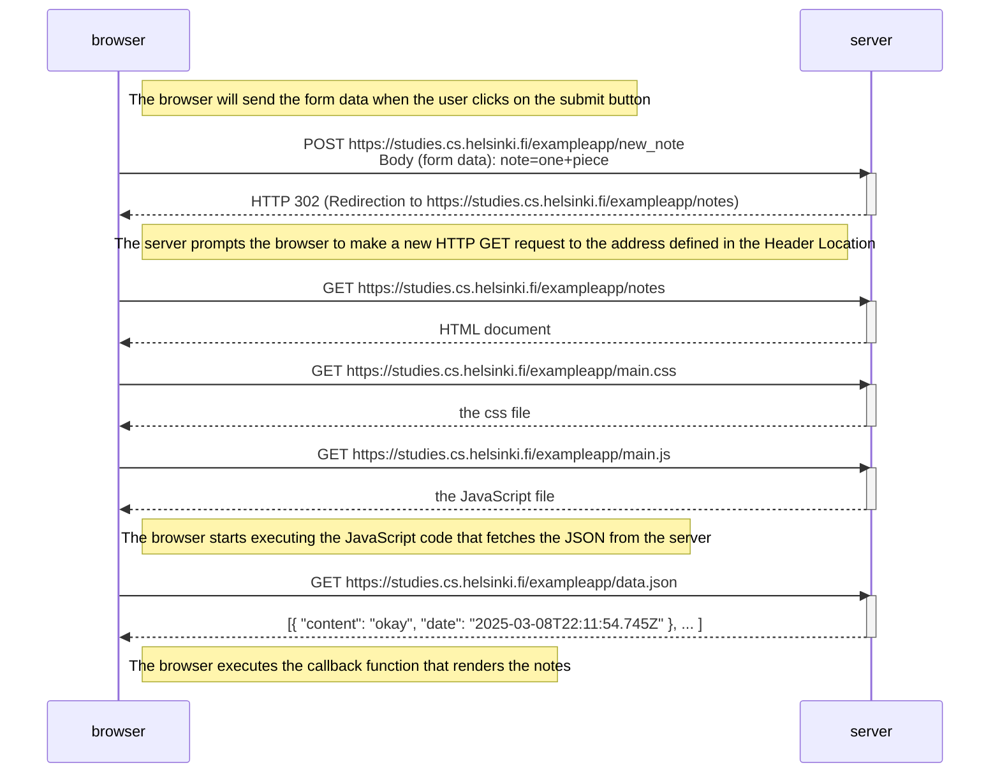

```mermaid

    sequenceDiagram
        participant browser
        participant server

        Note right of browser: The browser will send the form data when the user clicks on the submit button

        browser->>server: POST https://studies.cs.helsinki.fi/exampleapp/new_note <br> Body (form data): note=one+piece
        activate server
        server-->>browser: HTTP 302 (Redirection to https://studies.cs.helsinki.fi/exampleapp/notes)
        deactivate server

        Note right of browser: The server prompts the browser to make a new HTTP GET request to the address defined in the Header Location

        browser->>server: GET https://studies.cs.helsinki.fi/exampleapp/notes
        activate server
        server-->>browser: HTML document
        deactivate server

        browser->>server: GET https://studies.cs.helsinki.fi/exampleapp/main.css
        activate server
        server-->>browser: the css file
        deactivate server

        browser->>server: GET https://studies.cs.helsinki.fi/exampleapp/main.js
        activate server
        server-->>browser: the JavaScript file
        deactivate server

        Note right of browser: The browser starts executing the JavaScript code that fetches the JSON from the server

        browser->>server: GET https://studies.cs.helsinki.fi/exampleapp/data.json
        activate server
        server-->>browser: [{ "content": "okay", "date": "2025-03-08T22:11:54.745Z" }, ... ]
        deactivate server

        Note right of browser: The browser executes the callback function that renders the notes
```
