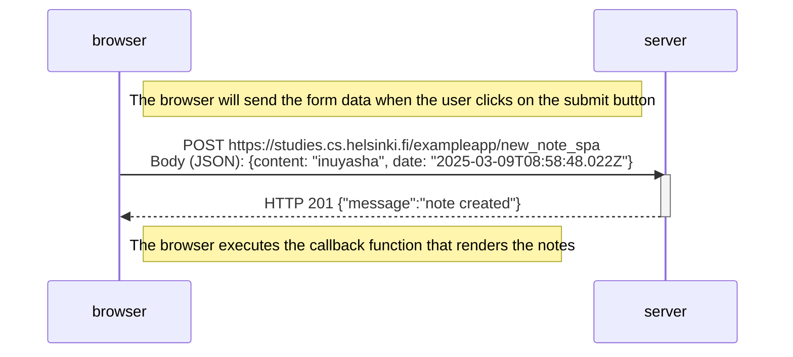

```mermaid

    sequenceDiagram
        participant browser
        participant server

        Note right of browser: The browser will send the form data when the user clicks on the submit button

        browser->>server: POST https://studies.cs.helsinki.fi/exampleapp/new_note_spa <br> Body (JSON): {content: "inuyasha", date: "2025-03-09T08:58:48.022Z"}
        activate server
        server-->>browser: HTTP 201 {"message":"note created"}
        deactivate server

       Note right of browser: The browser executes the callback function that renders the notes
```
